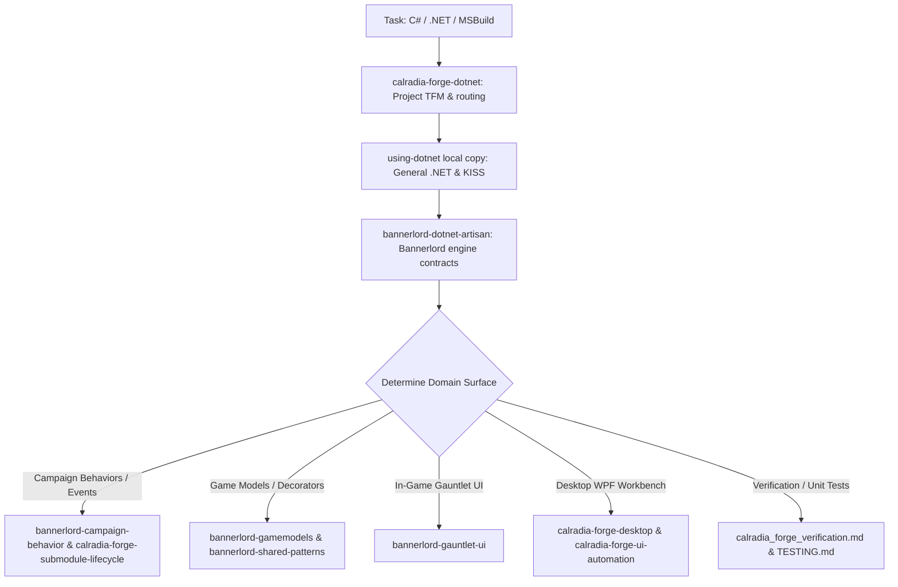

# using-dotnet — .NET Intent & Routing Discipline

> **Protected local copy:** This copy preserves Calradia Forge's .NET adaptations so an upstream skill update cannot overwrite or remove project knowledge. Start repository work with [`calradia-forge-dotnet`](../calradia-forge-dotnet/SKILL.md); use this copy for its retained general .NET and KISS guidance, then add the relevant domain skill.

Use this protected reference alongside the project gateway whenever handling C#, .NET solution files (`.sln`, `.slnf`), project files (`.csproj`, `Directory.Build.props`), WPF, or MSBuild tasks in this workspace.

---

## 1. Intent Detection & Trigger Conditions

Trigger this routing discipline whenever a task involves:
- Adding, editing, or refactoring C# source files (`*.cs`).
- Modifying solution configurations (`CalradiaForge.sln`, `CalradiaForge.Desktop.slnf`) or project files (`*.csproj`).
- Designing new services, behaviors, models, or UI view models in C#.
- Diagnosing C# compiler errors, runtime exceptions, or test failures.

---

## 2. Simplicity First (KISS) & Anti-Over-Engineering

Agents consistently over-engineer in .NET — introducing unnecessary abstraction layers, speculative interfaces, or redundant wrappers. Adhere strictly to these principles:

1. **Do the direct thing:**
   - If you need a file or asset, create it directly. Do not build code that generates it at runtime unless dynamically required.
   - If you need data, put it where it belongs. Do not assemble it from embedded strings or complex reflection if direct structures work.
2. **Write readable code over clever code:**
   - Prefer explicit `if`/`else` over nested ternary operators.
   - Prefer clear loops over dense, hard-to-debug LINQ chains (especially in performance-critical code).
   - Leverage modern C# syntax (`[..]`, switch expressions, pattern matching, raw string literals) because it is concise AND readable. Avoid convoluted logic.
3. **Don't add what wasn't asked for:**
   - No speculative config options, no unrequested refactorings, no preemptive error handling for impossible states.
   - Do not add XML documentation to existing unrelated methods.
4. **Earn every abstraction:**
   - Do NOT create `IFooService` if there is only ever one `FooService`.
   - Do NOT extract a helper function for an operation that occurs only once. Extract only when a genuine pattern emerges across 3+ distinct call sites.
5. **Fewer files, fewer layers:**
   - Do not create a Controller + Service + Repository + DTO + Mapper pipeline for a simple 30-line calculation.
   - Scale the architectural pattern to the exact scope of the problem.

---

## 3. Dual-TFM Architecture Awareness

In this repository, projects span two distinct .NET target frameworks. You MUST determine the target framework before recommending or implementing any API:

| Project Area | Target Framework | Language / Runtime Rules |
|---|---|---|
| **Game Module (`CalradiaForge.Mod`)**, **Core (`CalradiaForge.Core`)**, **SDK (`CalradiaForge.Sdk`)** | `net472` (.NET Framework 4.7.2) | `LangVersion` is set to `latest` (modern syntax supported), but BCL APIs are strictly limited to .NET Framework 4.7.2. Do NOT use modern BCL types (e.g. `TimeProvider`, `DateOnly`, newer `System.Text.Json` features unless explicitly referenced). TaleWorlds engine calls MUST remain on the main game thread. |
| **Desktop Workbench (`CalradiaForge.Desktop`)** & **Render Tests** | `net8.0-windows` (.NET 8 WPF) | Full modern .NET 8 BCL available (async named pipes, `System.Text.Json`, `VirtualizingStackPanel`). Runs outside the game process. No TaleWorlds assemblies allowed. |
| **Standalone Helpers (`BannerlordFbxImporter`)** | `net8.0-windows` | Separate experimental tool; keep distinct from game module and Desktop workbench. |

---

## 4. First-Step Routing Discipline

Before generating, planning, or editing any C# code, follow this sequence:

1. **Step 1:** Start with [calradia-forge-dotnet](../calradia-forge-dotnet/SKILL.md) to identify repository scope and TFM (`net472` vs `net8.0-windows`).
2. **Step 2:** Consult this preserved local copy for general .NET routing and KISS guidance; use the installed upstream .NET skill as complementary general guidance when available.
3. **Step 3:** For game code, invoke [bannerlord-dotnet-artisan](../bannerlord-dotnet-artisan/SKILL.md) to apply Bannerlord lifecycle and threading constraints.
4. **Step 4:** Dispatch to the specialized domain skill for the affected game or application subsystem.
