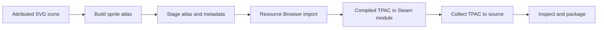

# Native Gauntlet icon assets

Calradia Forge uses nine Game-icons.net SVGs for its seal, navigation rail, search, recent-history marker, and context cards. The navigation uses distinct symbols by purpose: compass for Summary, gears for Modules, scroll for Logs, magnifying glass for Inspector, crossed swords for Tests, stopwatch for Metrics, gear-and-hammer for Framework, and banner for Extensions. Per-icon authors, source pages, licenses, and modifications are listed in `modules/CalradiaForge/GUI/SpriteParts/ATTRIBUTION.json`. The SVG files are preserved under `modules/CalradiaForge/GUI/IconSources/GameIcons/`.

`tools/generate_game_icons.py` converts the SVG foreground paths to WPF geometries and 128×128 source PNG parts. Run `tools/Build-CalradiaForge-UiAssets.bat` to validate those inputs and invoke Bannerlord's installed `TaleWorlds.TwoDimension.SpriteSheetGenerator.exe` for this module. It creates `GUI/CalradiaForgeSpriteData.xml` and `AssetSources/GauntletUI/ui_calradiaforge_1.png`; the category's `<AlwaysLoad />` entry must carry through from `GUI/SpriteParts/Config.xml`. Set `BANNERLORD_EDITOR_DIR` to the full `Win64_Shipping_wEditor` directory if the game is installed outside the default Steam location. The generated source atlas is not the runtime texture. Run `tools/Prepare-CalradiaForge-ResourceBrowser.bat` to validate and stage only the atlas and its metadata into the installed module. Existing destination files receive timestamped backups; the module manifest and DLLs are never copied. `--dry-run` previews the operation, and `--launch-editor` opens the Modding Kit only when Bannerlord is not already running. A source/installed version mismatch is reported because this helper stages static UI assets only; it does not update the installed mod. Then use the Modding Kit Resource Browser to compile the TPAC:

1. Launch the installed Bannerlord Modding Kit and enable Calradia Forge.
2. At the main menu open the in-game console with `Alt` + `` ` `` and run `resource.show_resource_browser`.
3. Select Calradia Forge, open `Assets/GauntletUI`, scan new asset files, and import `ui_calradiaforge_1.png` for `ui_calradiaforge`.
4. Confirm the generated `Assets/GauntletUI/ui_calradiaforge_1_tex.tpac` exists, then run `tools/Prepare-CalradiaForge-ResourceBrowser.bat --collect-tpac` to copy it back into the source module. Restart the game after importing so the atlas cache is refreshed.

The source workspace and Steam installation can contain different Calradia Forge versions. The helper checks the module ID and prints both versions before staging or collection, so do not treat a successful asset import as a complete module update. Collection calls `TpacTool.Lib` before any source write; only a package whose metadata is accepted is copied, and an existing source copy receives a timestamped backup. This does not decode texture payloads or certify rendering. The current 538-byte package has a plausible TPAC v2 header: one declared item and a 441-byte table of contents ending at byte 477. The available TpacTool reader then fails while reading an asset GUID. That leaves entry metadata unverified; the reader error alone does not prove Resource Browser output is corrupt. Do not overwrite or collect it until a version-compatible metadata reader succeeds.

For larger raw-source folders, create an inventory-only work order with `tools/Plan-CalradiaForge-AssetBatch.bat -SourceDirectory "C:\\AssetSources" -OutputJson "C:\\Reports\\asset-batch.json"`. The report hashes candidate files, records relative paths and sizes, identifies repeated basenames for manual review, and separates documented FBX/PSD sources and sprite-generator PNGs from unverified extensions. It is bounded to 50,000 files, 50,000 directories, 5 GiB of candidate data, and 64 directory levels by default; reparse points are skipped. Put the JSON outside the source tree. Existing reports require `-Force` and receive a timestamped backup. A complete inventory exits successfully; a partial scan writes a report marked `partial` and returns a nonzero status; exceeding a hard limit writes no report. This is a read-only inventory: it does not create `.meta` files, import assets, invoke a compiler, or label a file as successfully compiled. A repeated basename is a review item, not proof of an engine-level collision.

Schema v4 adds `recommendedWorkflow`, `toolAvailability`, `atlasMappings`, bounded planner duration, and an optional PowerShell process peak-working-set observation. It checks whether the official sprite-generator executable and companion library exist under `BANNERLORD_EDITOR_DIR` (or the default Steam editor folder); pass `-EditorDirectory "C:\\Program Files (x86)\\Steam\\steamapps\\common\\Mount & Blade II Bannerlord\\bin\\Win64_Shipping_wEditor"` to select another installation. It never launches the generator. Sprite generation is marked `manual-run-ready` only when both files are present and still requires a visible interactive console. A `GUI/*SpriteData.xml` file is read with a 4 MiB cap, DTD processing disabled, and external XML resolution turned off. Atlas filename/category/sheet matches provide import hints; a predicted TPAC path is not proof that the Resource Browser produced it. Atlas import and runtime TPAC verification remain `manual-required` or `not-attempted`; those statuses are never reported as completed by the planner. Duration covers inventory, candidate hashing, `SpriteData` parsing, and mapping. Peak working set covers the PowerShell host process lifetime and is not per-operation allocation or game memory. Generator duration/memory, throughput, game performance, and crash reduction remain `not-measured`.

The supplied AI-generated architecture infographic is not an API specification. Its example `.meta` and `.fbs` edits, `/run_asset_compiler` switches, redirected-stdin automation, and Roslyn runtime injection are not implemented because the project's documented or installed interfaces do not establish those contracts. Its percentage, throughput, memory, and crash figures have no reproducible benchmark evidence and are not adopted as Calradia Forge measurements. See [Asset automation evidence review](ASSET_AUTOMATION_EVIDENCE.md) for the claim-by-claim disposition.

When metadata parsing fails, the inspection BAT prints the module and package paths, file size, declared asset count, SHA-256, parser reason, and a Resource Browser retry step. The collection BAT propagates that diagnostic and exits before changing the source package. A failure means the selected reader could not verify the package; it is not a claim about why the Resource Browser produced it.

TpacTool is an optional inspection aid after the Resource Browser import. The Source-SDK archive does not include it. For a package build, place the upstream release in the repository-level `TpacTool` folder so `TpacTool/bin/TpacTool.Lib.dll` is available; the release script stops if structural verification cannot run. Run `tools/Inspect-CalradiaForge-Tpac.bat --validate-only`; the local reader checks the package header and asset metadata without loading texture data. The full command then opens the viewer only after this parse succeeds and prints the directory to select with **File > Open AssetPackages Folder**. The preflight does not decode texture payloads, verify the rendered sprite, or prove cross-version compatibility. The local download is version 0.4.0; upstream describes it as a viewer/exporter and says package creation/import is not implemented. The 0.4.0 release targets Bannerlord 1.8.0 beta, while Calradia Forge targets 1.4.8, so compatibility remains unverified. Use the Modding Kit Resource Browser for import. TpacTool is locally supplied and is not copied into release archives. Its upstream project is MIT-licensed; see the [upstream README](https://github.com/szszss/TpacTool#readme), [release notes](https://github.com/szszss/TpacTool/releases), and [license](https://github.com/szszss/TpacTool/blob/master/LICENSE).

To inspect the module currently installed under the default Steam library, add `--installed` to the same batch command. Set `BANNERLORD_GAME_DIR` first if Bannerlord is installed elsewhere; the command remains read-only.

When both versions have TpacTool-accepted inventory JSON reports, compare their asset metadata with `tools/Compare-CalradiaForge-TpacInventory.bat -BeforeReport before.inventory.json -AfterReport after.inventory.json`. The comparison matches entries by asset GUID and reports added, removed, changed, and unchanged counts; `-IncludeUnchanged` lists retained entries, while `-OutputJson report.json` writes an export. Existing exports require `-Force` and receive a timestamped backup. Inputs remain untouched. This compares reported metadata only: it does not reopen the TPAC files, decode texture data, verify that reports still match their source hashes, or establish game compatibility. A metadata reader failure means that report is unavailable for comparison, not that the TPAC is corrupt.

The comparison preserves each report's `createdUtc` as `capturedUtc` in UTC, prints the before/after capture times and the comparison time, and rejects invalid or timezone-less timestamps. Timestamps must match the complete ISO form with `Z` or an explicit `±HH:mm` offset; trailing whitespace/newlines are rejected, and `-00:00` is refused because it means the local offset is unknown. Offsets are normalized to UTC. The validator also checks required nested report fields, invariant unsigned values, a JSON array for assets, the reader's 128 MiB file-size bound, and that the declared TPAC v2 table-of-contents size fits after its 36-byte fixed header. This makes the snapshot sequence visible around a Resource Browser import; it does not prove when the underlying TPAC was last changed, revalidate its hash, or authenticate the report's provenance.

For a local audit that must exercise the metadata reader, run `tests/CalradiaForge.TpacInventory.Tests.bat -RequireReader`. This mode fails when the reader or Native fixture is missing or Windows blocks the assembly; the default mode reports a portable `SKIP`. `-ToolDirectory "C:\verified\TpacTool\bin"` can point the strict test at a separately verified reader directory.

The source atlas and sprite metadata can be regenerated without the Resource Browser, but the game needs the imported texture package at runtime. The batch helper returns success only after the official generator exits normally and source validation passes; launch it from a visible Windows console because the game tool waits for a key at completion. The release audit requires source assets and the runtime texture package separately. If RGL reports `Unable to find texture: ui_calradiaforge_1`, import the atlas in Resource Browser, collect the `.tpac` with `--collect-tpac`, then restart the game so the asset manager reads the compiled package.

Desktop's **Gauntlet Sprite Package Auditor** checks `SpriteData` sheet declarations, duplicate/missing sheet references, safe part paths, part rectangles within sheet bounds, source part PNG IHDR dimensions, and atlas PNG dimensions. It reads only the PNG signature/IHDR header; it does not decode pixels or validate CRCs. For TPAC it checks the 36-byte v2 header, rejects truncated headers and declared asset counts outside 1–100,000, and bounds the declared table of contents to the file. A plausible header is limited evidence; it does not parse asset entries or texture payloads. The dedicated batch preflight adds a separate `TpacTool.Lib` metadata parse. Use the official SpriteSheetGenerator for atlases and Resource Browser for importing them into the game.

The official Bannerlord workflow documented for this project is SpriteSheetGenerator followed by Resource Browser import. Inspection of the installed managed assemblies and official import documentation did not find a documented public C# FBX importer or `.meta` sidecar contract for batch-driving Resource Browser. `.meta` conventions from other game engines do not establish Bannerlord support. This project therefore does not generate speculative sidecars or claim an FBX/TPAC batch importer.
